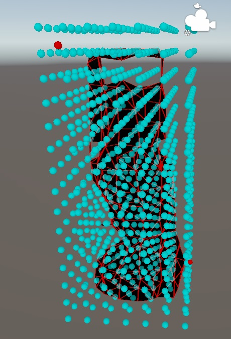
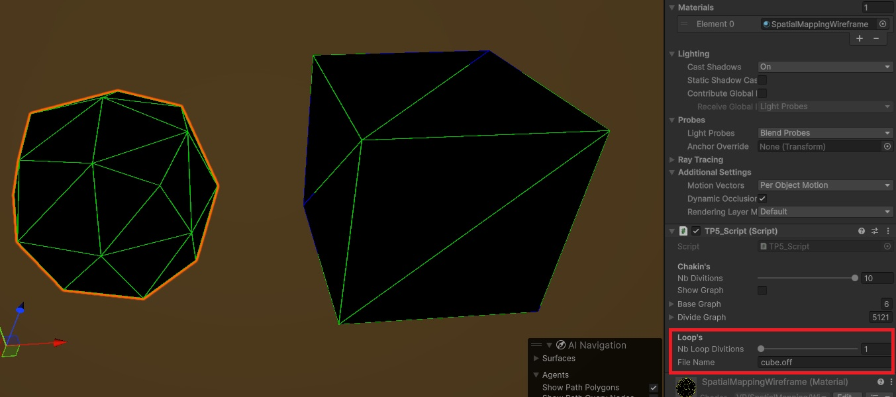
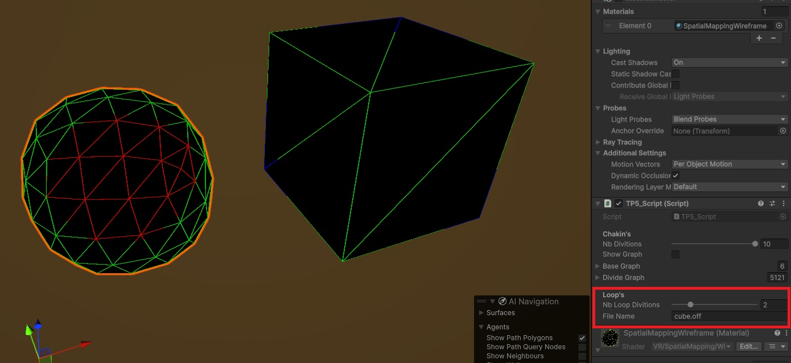
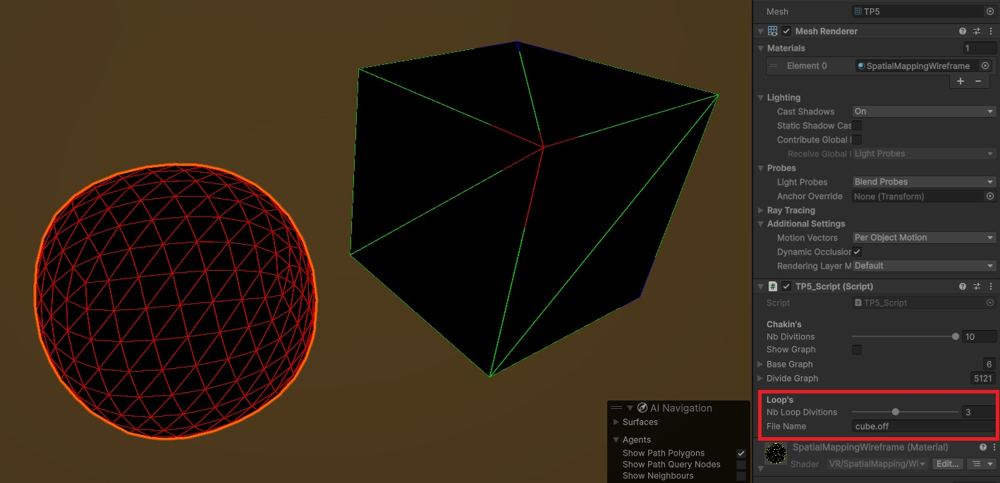
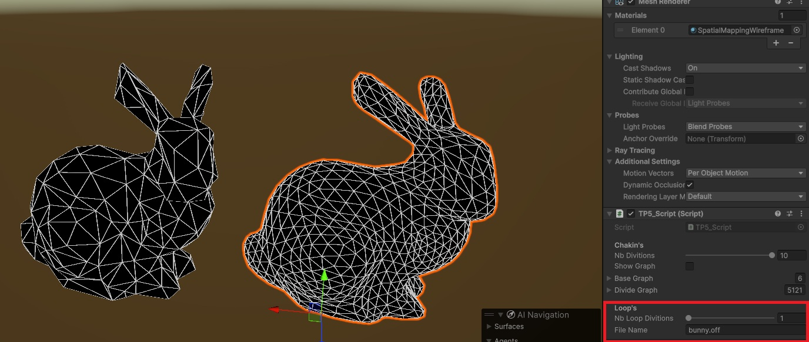
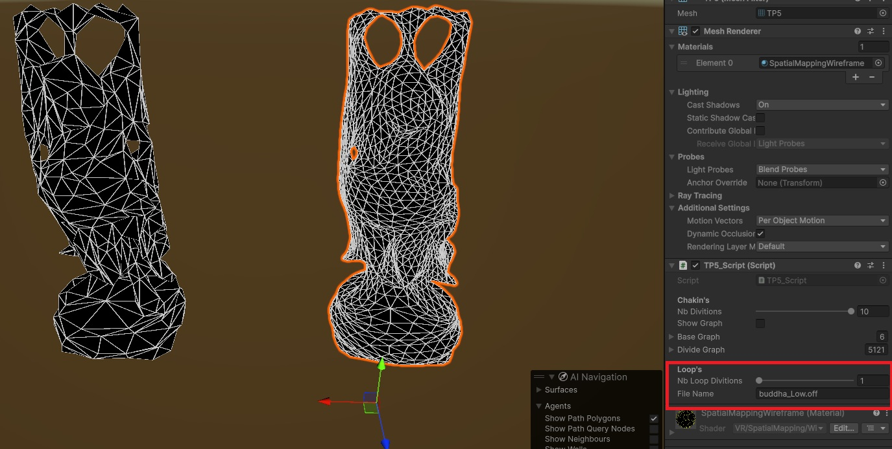

# Mesh Surfaces Subdivision 
## Subdivision Algorithm
Unity project for subdivision algorithms.

## Description
This directory contains the source code of a Unity project in which I developed a script implementing Chaikin's corner-cutting algorithm and Loop's subdivision algorithm.
The script allows you to configure the level of subdivision for both graphs and meshes.

##  Subdivision Results 
### Chakin's

### Loop's
#### Simple Cube Mesh

#### Bunny Mesh

#### buddha Mesh

